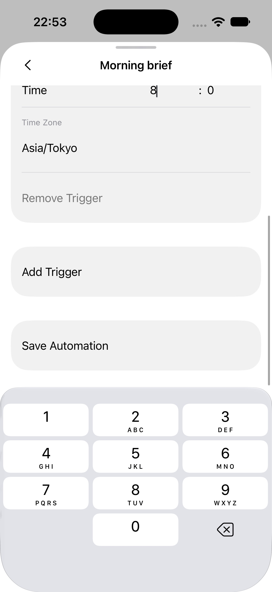
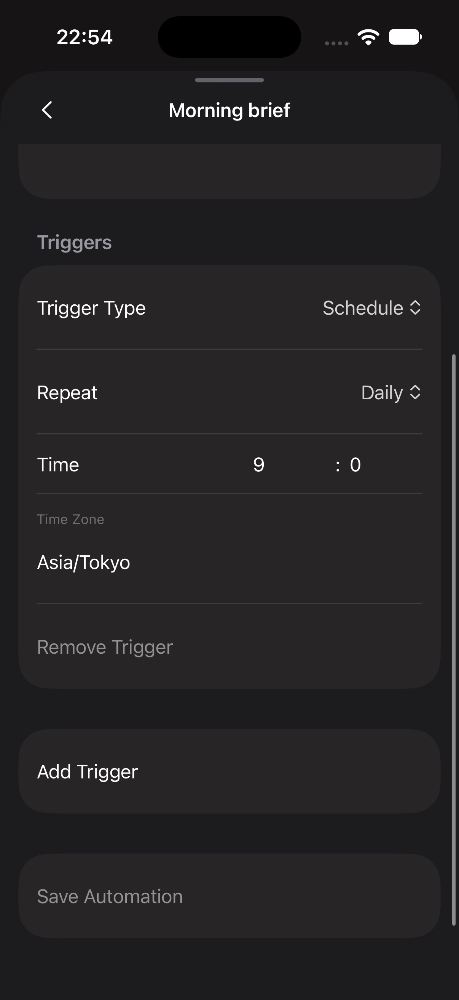

# iOS automation input regression evidence

Issues: #4876, #4877.

- Environment: iOS 27 simulator, 402 × 874 points, native development build from baseline `6210df89d`; branch `fix-4876-4877-automation-input`, Metro served by that worktree.
- These are actual native controls, not design mockups. The production automation sheet was mounted with a temporary local resource fixture because the paired host timed out. The fixture and temporary route were removed before committing. No automation was created or executed on the host.
- Chinese Pinyin composition in Name was committed as `应`; Instructions then accepted `一`, and Enabled could be toggled off.
- Actual on-screen numeric keyboard taps: hour `9 → empty → 12 → 1 → empty → 8`; minute `0 → empty → 30 → 3 → empty → 05`. These input sequences were verified before the save-button placement follow-up; the current screenshots below show the corrected save placement.
- Automated component tests separately exercise the actual sheet/native-view composition and remote action arguments, dirty/clean refresh, server rejection, and trigger/filter changes.
- Not verified: the reporter’s iPhone 17 / iOS 26.0.1 with its third-party keyboard; live host persistence/next-run readback after this change; Android device. The original failure was not reproduced on iOS 27 before the change. These screenshots establish the replacement native path works on this simulator, not a reproduction of the original environment. The development build label was not captured in these sheet screenshots.

## Save placement follow-up

The Save action is now an independent section inside the native Form, matching the profile editor. It scrolls with the fields instead of occupying a fixed footer above the keyboard. The component regression checks that Save belongs to the same Form as the fields and still invokes the existing action.

Verified on the same iOS 27 simulator using the temporary local resource fixture: software keyboard open (Light), returning/discarding the draft and reopening with the keyboard closed (Dark), scrolling to the Save section, and the disabled state for an unchanged draft. No live save was performed.

| Keyboard open, scrolled to Save (Light) | Keyboard closed, unchanged draft (Dark) |
| --- | --- |
|  |  |
