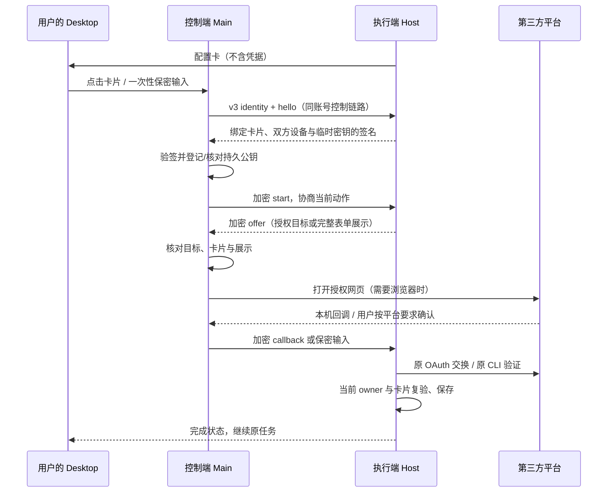

# 远程插件授权与配置

本功能连接两台已登录同账号、已允许 Device Link 控制的 Desktop。执行任务的 Host
拥有插件及凭据，控制端 Desktop 提供浏览器和保密卡片。协议及实现正本为
`packages/device-link/src/plugin*.ts` 与 `apps/desktop/src/main/plugin-oauth/`。
它不依赖 CIS、云实例配置、定制发行包或新的服务端接口。

## 用户流程

1. Agent 按现有花名册及 `ghost_info` 发现插件；缺少当前请求必需的插件时，复用市场
   搜索/安装工具及既有权限策略。安装成功不表示账号已授权。
2. setup 检查或 `connect_account({kind:"plugin",id})` 在执行设备创建现有配置卡。
   用户明确要求换 Token、更新授权或重新配置时使用 `reauthorize:true`，即使已有连接。
3. 用户在连接该设备的 Desktop 点击卡片。Main 验证目标、握手、卡片版本及授权来源，
   再打开本机浏览器或发送保密表单；没有额外确认窗口。
4. OAuth 回调在本机接收，加密回到原 Host；原 Host 保管 PKCE verifier，并用原始
   redirect URI 交换、保存账号。Device Flow 由原插件/CLI 继续轮询。
5. Host 收到本卡片的实际提交回执并复验后才继续任务。浏览器打开、回调到达、配置
   已保存都不能单独证明平台权限；后续用最小只读操作检查实际可用性。



## 身份与信任边界

- 使用上游同账号 Device Link 准入，执行端仍检查远程控制开关和 controller 撤权。
  **首次公钥登记信任账号服务与 relay**；验签证明持有对应私钥，但首次登记时不能防止
  恶意 relay 同时替换描述符及握手。不得称为独立身份认证、双向设备证明或 CIS 验证。
  执行端对控制端的身份和准入仍依赖既有 Device Link 链路；持久 pin 保护控制端所认的
  执行设备，不把它解释成可抵御账号服务或 relay 冒充控制端的双向独立认证。
- 执行端使用独立用途的持久 Ed25519 密钥；控制端验签成功后才固定对端公钥。两端
  按 realm/membership/local device 分域，使用 Electron safeStorage 加密落盘，原子写入
  和跨进程锁；不复用通讯录密钥，不在启动/能力投影时访问钥匙串。
- 文件在 `ownerScopedUserDataPath('plugin-oauth', <scope-sha256>.v1.enc)`，含本机签名
  密钥及该域的 peer pins。Linux 无安全后端、`unknown`、`basic_text` 均拒绝。
  损坏或跨身份移植的文件不得重新生成后放行。重启沿用密钥，生成新的 bootId。
- 已登记 peer 换钥直接拒绝；没有自动清 pin、信任新钥或删除凭据的恢复入口。
  重装丢失密钥时需先核实并重新登记设备身份；本 PR 不提供绕过 pin 的恢复按钮。
- 两端 Main、OS、安全存储、执行插件/CLI 与既有账号服务仍在可信基座内。Node 插件
  拥有系统用户权限；本桥不是同 UID 进程隔离，也不能阻止有权插件使用已授予的能力。
  relay 后续仍能拒绝服务、观察路由元数据；普通控制通道的信任模型不变。

## v3 机器契约

私有外层通道为 `device-link:plugin-oauth:v3`。独立于实验云分支的 v2，不降级回它。

控制端和执行端都必须实现 v3；设备已连接、可创建任务或能投影旧授权卡片，不代表授权桥兼容。
执行端返回 `CHANNEL_NOT_ALLOWED` 时，本机授权 IPC 以 `UNSUPPORTED_CAPABILITY` 拒绝，
卡片明确提示更新远程设备上的 Cindy。其它前置失败只显示受控的失败提示，不展示原始异常、
provider 响应或凭据。提示仅保存在控制端内存，并绑定账号代次、当前请求与 revision；重试、
取消或新卡片不能被迟到的旧失败覆盖。它不改变 Host 的权威卡片 phase，也不进入任务历史。


```ts
type IdentityRequest = { op: 'identity'; version: 3 };
type PeerIdentity = {
  version: 1; // 描述符结构版本，不是外层通道版本
  realm: 'cn' | 'global'; membershipId: string; deviceId: string;
  publicKey: string; // Ed25519 SPKI DER, base64url
  bootId: string; observedAtMs: number; expiresAtMs: number;
};
type Action = { requestId: string; actionId: string; expectedRevision: number };
type Hello = { op: 'hello'; version: 3; nonce: string; publicKey: string; action: Action };
type HelloReply = {
  version: 3; id: string; publicKey: string; bootId: string;
  ghostId: string; expiresAtMs: number; signature: string;
};
type Exchange = { op: 'exchange'; id: string; box: string };
// 解密请求：{ nonce, request: InnerRequest }
// 解密响应：{ nonce, ok: true, result } | { nonce, ok: false }
```

描述符必须精确匹配当前 realm、membership、目标 device，最长 60 秒。
身份查询与 hello 必须走同一已授权通道。签名绑定上述身份、控制端设备、签名公钥、
bootId、双方临时 X25519 公钥、nonce、事务 ID/期限、卡片/action/revision 和插件。
先验签并持久核对 pin，再发 start/打开网页。X25519、HKDF-SHA256、AES-256-GCM
保护之后的请求和响应，方向/事务纳入密钥派生；回包需匹配请求 nonce。

内层保留事务 `version:1`，只接受 capabilities/start/status/callback/cancel。
`deviceUserCode`、`authorizationV1`、`secretSubmission`、`connectionSubmission`
逐项协商，缺字段即不支持；不得改走通用 invoke 或让用户把秘密贴到对话。
解析器拒绝未知字段；请求不能指定命令、存储路径、密钥名、身份 authority 或 bearer。

## 支持方式与扩展

| 方式 | 接入点 | 完成的事实来源 |
| --- | --- | --- |
| 声明式 OAuth / broker | 既有 `network.secrets[].source=oauth` | 原 Host 交换/保存/复验 |
| 设备码 | Node `bindAuthorization` 的 `kind:'device'` | 原插件/CLI 领取并验证 |
| 浏览器确认页 | `kind:'browser'` | 原插件/CLI 轮询/确认 |
| CLI PKCE loopback | `kind:'loopback'` | 原可信 Node 保管 verifier 并交换 |
| API Key/PAT | 既有 user Secret `inline_form` | 原 executor 保存指定 Secret |
| 服务地址 + Token | 既有 `network.connections` 的 `manage_connection` | 原 ConnectionManager 保存 |

声明式 OAuth 和连接表单沿用已装插件格式，不要求重装/重新批准/更换凭据。
CLI 特殊登录需主动调用类型化接口，不能自动解析任意 stdout。通用适配器在
`authorizationAdapters.ts`；Node 接线在 `nodeAuthorizationClient.ts`、
`nodeDeviceAuthorizationClient.ts`、`nodeSecretSetup.ts`。`forge.ts` 记录其作者契约。
不允许插件提供 Host 可执行命令或加载任意适配器模块。

GitHub 的 Linux 专用登录 helper、云镜像和 gh-cli 凭据源改动不在本分支；上游原有
GitHub 登录来源与设置保持可用。通用设备码框架及已审查 URL 限制保留，但不能据此
声称任意平台的 GitHub CLI 登录已自动接入。TapTap 等 CLI 插件也须实际使用上述接口。

标准 OAuth 目标由当前已批准的 manifest 与 broker 配置约束；设备/浏览器授权只允许
HTTPS 默认端口，专用 provider 目标由 `builtinAuthorizationTargets.ts` 精确校验。
卡片绑定 manifest 快照，提交时再次检查。CLI loopback 限显式非特权端口、固定路径、
唯一 state/redirect_uri/client_id/response_type=code/S256 challenge；不提供任意 HTTP
转发。端口占用时失败，不抢端口、不杀进程、不改注册地址。

CLI 的 `localhost` 回调在同一端口监听 `127.0.0.1` 和 `::1`，共用 state、卡片校验和
一次性消费状态；显式 IP 回调只监听该地址，不监听通配接口。任一可用地址的端口冲突
会关闭本次全部监听器；只有 OS 明确不支持某地址族或该回环地址不可用时才使用另一族。
回归见 `plugin-oauth/__tests__/loopbackListener.test.ts`。

## 保密输入与设备码

专用本机 IPC：

- `plugin-oauth:assist`：deviceId、ghostId、requestId、actionId、expectedRevision。
- `plugin-oauth:submit-secret`：相同绑定 + value + 完整 presentation。
- `plugin-oauth:submit-connection`：相同绑定 + `{host,token}` + 完整 presentation。
- `plugin-oauth:device-code`：设备/插件/request/action + read/copy/reopen。

这些接口仅接受可信自有顶层 Renderer，不进入通用远控 allowlist。
输入只在原组件及一次性 Main 调用短暂存在；签名握手后比较目标 Host 的完整字段展示，
再加密发送。存储 key 由最新声明解析，不能由请求选定。user Secret 不接受 OAuth、
gh-cli、oidc-token 或账号 vault 写入；临时 Node Secret 卡只允许其已声明方法/入口。
连接地址只接受 HTTPS 默认端口 DNS 主机/根 URL，无路径/query/自定义端口/IP。

伙伴消息内的 Bot 授权卡目前只接通远程插件 OAuth 和取消，不支持远程 Secret/连接表单。
即使旧消息或较新 Host 的快照携带这些表单能力标记，也禁用输入并提示在执行设备完成，
不会先收取再丢弃凭据；本地伙伴卡片的保密输入保持原路径。Host 发卡、远程投影及真实
表单组件的连通测试见 `BotAuthorizationCard.forms.test.tsx`。

重新配置必须收到**本卡片/action/revision 的实际保存回执**，普通 change event 或旧值
不能让新卡片提前结束。同地址保留原连接 ID/默认选择；提交前取消保留旧凭据。保存成功
表示配置写入，第三方验证失败不会自动恢复被替换的 Token，也不能宣称已登录。

已保存的 user Secret/API Key/PAT 同样支持显式重配。协调器只为当前提交创建 Main 内
的写入能力，绑定插件、卡片动作及声明的 Secret；最终 executor 重新检查当前声明、
任务取消与工作目录准入，再覆盖该值。保存失败保留旧值，成功回执先于 change 事件，
才能解除本卡片的重填要求。该能力不进入 wire DTO，Renderer 不能提交 force 标记或
自行选择存储 key；一般 readiness 检查仍复用已有值，不重复要求用户授权。

输入在提交、取消、换卡/设备及卸载时清空。设备用户码仅在发起授权的本机卡片显示，
可重复复制/重开 Main 保管的页面；不包含 callback code、device_code、token、state 或
完整 URL。它不进入聊天 store、历史、镜像、日志或模型。结束/过期清内存，剪贴板仍为
同一码时才清除；复开不新建事务，也不恢复已消费的码。

## 生命周期、兼容及降级

- owner、peer 代际、卡片、期限和权限在异步边界及写入前复验。账号/连接失效、取消、
  超时后的晚到结果不得写入；本机窗口消失也收口监听器。取消不承诺撤销平台已完成的 consent。
- 事务最长五分钟，只在内存；每 Host 最多 16 个握手、每 peer 最多 4 个。相同 nonce/
  密文重试复用回执，不重复交换，复用 nonce 搭配不同密文拒绝。
- 单 peer 断链仅取消该 peer；共享 relay/账号退出取消全部。不开全局重连、不动别的
  peer。Node 请求显式传入 `cancelWithCall:true` 和当前 `callId`，才启用授权卡及
  随 task stop/abort 回收所属进程的生命周期。单独携带旧 `callId` 或省略开关都
  保持上游独立 RPC 行为，不自动弹卡或结束后台进程。已停止的调用不能迟到启用新授权。
- 两端 Desktop 必须支持 v3。旧版仍可使用原本的远控及执行设备本地设置；新授权动作
  不走旧通道/明文降级，不会替用户清空已有凭据。
- Mobile 当前只可查看/取消既有卡片，未实现本机回调与保密输入；在连接该设备的新版
  Desktop 完成。网站 Cookie/全量 vault 同步不在范围。
- Auth、relay、CIS、Model Access 不需要本功能的新服务接口或部署；双方客户端需升级。

### 各端范围与后续门禁

| 场景 | 本 PR 的处理 |
| --- | --- |
| Desktop → Desktop Device Link | 已适配：新私有通道经同账号授权、卡片绑定及签名握手；原有 invoke/push 规则不放宽。 |
| Mobile → Desktop Device Link | 保留既有只读配置状态、取消和完成状态。手机侧保密输入、设备码操作与浏览器回调尚未适配，必须在 PR 链接专门的跟踪 issue 后才能满足上游延期要求，不能把这三项写成已支持。 |
| SSH 工作区 | 本 PR 不新增 SSH 凭据转发或远端插件安装。SSH 的 Agent/workdir 仍经 maker-remote-ssh、cc-manager 与 remote-file-service；插件由提供 MCP 的 Desktop Host 管理，授权仅改变该 Host 的连接。SSH 主机没有本桥的 Desktop 身份、OS 密钥存储和 Device Link peer，不能把它当作另一个被控 Desktop，也不向其 HOME/workdir 复制本机凭据。原有远端文件、网络与 Forge 限制保留。 |

故障范围：单卡片取消/超时只收口该事务；单 peer 失效只取消该 peer 的事务；账号退出
或整条 relay 失效才取消全部。桥不强拆或重建全局 relay。自动化多 peer 用例见
`plugin-oauth/__tests__/lifecycle.test.ts` 与 `transport.test.ts`：两个控制端同时授权，
其中一个断链后另一个仍能完成；这些是本地传输测试，不是生产 relay 验收。

## Agent 指引与验证

普通 Desktop 的 Claude/Codex/Pi system prompt 与上游一致，不注入全局授权提示词。
本 PR 只在相关工具的 schema/description 中说明发现、必要安装、发起卡片和显式重配；
原有工具批准策略不变。工具描述有增量，不能声称整个模型请求或缓存键完全不变。
云实例的全局指引保留在独立云分支，由云运行环境启用，不属于此 PR，也不加入普通
Desktop 的 system 段。

可用显式 opt-in 的 `scripts/eval-plugin-authorization.mts` 对比上游基线：两组均使用三种 Host
原有提示词片段，只切换真实 MCP schema/handler，通过真实模型覆盖必要安装、首次授权、已保存
Secret 重配、取消、无关任务及相同前缀重复请求，记录行为、usage/cache、首事件与总耗时。
插件安装/账号结果为合成数据，不操作真实账户；现有模型登录仅在内存只读使用，不刷新或
复制授权文件，结果写系统临时目录。该脚本评估 Host prompt profiles，不启动原生
Claude/Codex/Pi 二进制，也不能证明 Anthropic 原生缓存、真实双 Desktop 或第三方登录
通过。PR 必须附实际结果及此范围说明，不用字符串单测替代指标实测。

自动测试以虚构身份/凭据及临时目录覆盖持久密钥/peer pin、跨身份拒绝、签名绑定、旧端
拒绝、加密重放、真实本地 WebSocket/TCP 回调、Host coordinator/executor 写入、取消及
Node 回收、设备码/保密表单和重配回执。OS secureStorage、relay 准入及第三方 HTTP 可为
测试替身，不能将这些结果报告为真实平台登录或线上部署完成。
发布前应另行验证各目标平台安全存储、双 Desktop 实际登录、provider 风控/MFA/回调策略。
